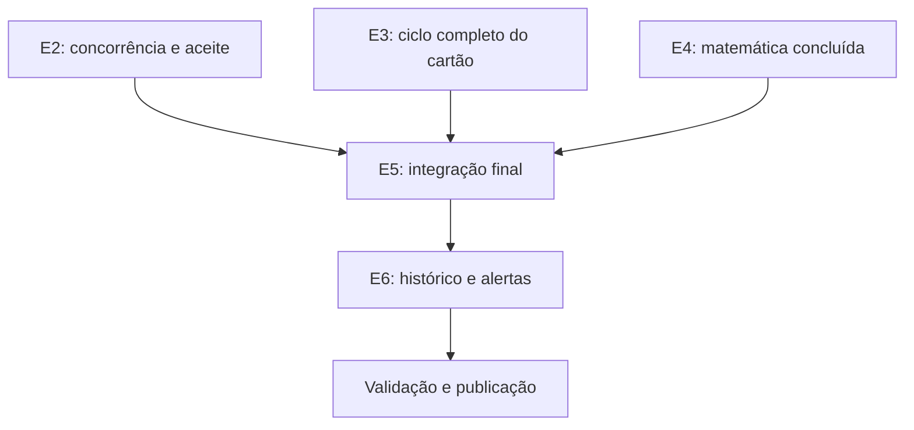

# Planejamento financeiro — etapas de execução

## Objetivo e fonte de verdade

Este roteiro acompanha a execução do [contrato funcional](FINANCIAL_PLANNING_CONTRACT.md). Ele descreve o estado atual da branch `codex/copilot-mod-v1-hardening`, não o estado histórico de incrementos intermediários.

As decisões P1–P6 foram aprovadas em 2026-09-08. WhatsApp e importação OFX permanecem fora desta publicação e não bloqueiam o fechamento. O detalhamento técnico e as pendências operacionais ficam em [CODEX_HANDOFF.md](CODEX_HANDOFF.md).

Estados usados:

- **Concluída:** implementação e testes automatizados cobrem o escopo contratado da etapa.
- **Parcial:** há implementação utilizável, mas ainda falta parte do contrato ou da aceitação.
- **Pendente:** não há entrega suficiente para declarar a etapa utilizável.
- **Fora da entrega:** escopo explicitamente adiado.

## Estado consolidado

| Etapa | Estado | Entregue | Falta para fechar |
| --- | --- | --- | --- |
| E0 — Contratos verificáveis | Concluída | Regras P1–P6, fórmulas, exemplos e invariantes registrados | Manter documentação sincronizada quando o comportamento mudar |
| E1 — Configuração financeira | Parcial | Configuração mensal, proteção fixa/percentual, essenciais, categoria rápida, isolamento, auditoria e controle de versão | Aceite visual no Edge desktop/mobile |
| E2 — Planejamento e liquidação | Parcial | Previsões, recorrência, edição/remarcação, parcial, residual, excedente, cancelamento, vínculo, desvínculo e revínculo explícito | Concorrência no banco de produção e aceite visual |
| E3 — Cartões e parcelas | Parcial | Cartões, compras parceladas, parcelas, pagamentos parciais, alocação determinística, dívida carregada e encargos confirmados | Antecipação com desconto, estorno de compra e crédito explicitamente aplicado |
| E4 — Calculadora matemática | Concluída | Proteção, progresso de recebimentos, projeções, essenciais, margem, verba diária, déficit e faixas | Manter matriz de fronteiras ao evoluir regras |
| E5 — Integração e indicadores | Parcial | Adaptadores reais, visões atual/projetada, neutralização de transferências/estornos, encargos e dashboard de planejamento | Jornada integrada final, isolamento transversal e aceite visual |
| E6 — Histórico e alertas | Parcial | Fechamento diário, reconstrução, revisões, proveniência, alertas deduplicados e gatilhos imediatos | Aceite editorial/visual da página de alertas |
| E7 — WhatsApp | Fora da entrega | Contrato de independência preservado | Implementação futura em contrato próprio |

## Dependências de fechamento

E1 pode ser usada independentemente. E2 e E3 alimentam os indicadores de E5. E6 consome os resultados de E5, mas uma falha de histórico ou alerta não deve impedir o registro financeiro principal.

## E0 — Contratos verificáveis

### Entregue

- Competência versus pagamento, valores decimais exatos e calendário de Brasília.
- Invariantes de vínculo, residual, idempotência, exclusão, restauração e correção.
- Regras de proteção, essenciais, projeção, cartões, histórico e alertas.
- Exclusão explícita de WhatsApp e OFX da publicação atual.

### Gate permanente

Nenhuma mudança de código pode alterar silenciosamente uma decisão contratada. Ambiguidade de produto volta ao contrato antes da implementação dependente.

## E1 — Configuração financeira

### Entregue

- Configuração por mês, distinguindo ausência de dado de zero confirmado.
- Proteção fixa ou percentual e orçamentos essenciais por categoria.
- Cadastro rápido de categoria de despesa sem perder o formulário.
- Isolamento por usuário, transação, auditoria, soft delete e controle de versão.

### Pendente

- Validar no Microsoft Edge desktop e em viewport móvel real.
- Confirmar teclado, foco, zoom, valores longos e persistência visual do formulário.

## E2 — Previsões, compromissos e liquidação

### Entregue

- Cadastro unitário e série recorrente mensal, inclusive retorno ao dia 31 após fevereiro.
- Edição da ocorrência ou das futuras ocorrências elegíveis da série.
- Remarcação do residual sem mover recebimentos já realizados.
- Vários recebimentos parciais por previsão e uma única previsão ativa por receita real.
- Pendência, cumprimento e excedente informativo sem duplicar renda.
- Cancelamento preservando valores já recebidos.
- Desvínculo por estorno/exclusão e revínculo somente por confirmação explícita.
- Idempotência, versão otimista, auditoria, isolamento e rollback nos fluxos cobertos.
- Atualização imediata dos alertas após criação, alteração, cancelamento e vínculo efetivos.
- Transferências agora adquirem o mesmo lock de usuário usado pelas mutações estruturais de conta/caixinha antes de ler saldo ou gravar pernas, reduzindo a janela de corrida com exclusão/restauração.
- Restauração de conta também serializa pelo usuário e bloqueia as relações restauradas em ordem determinística.

### Pendente

- Executar evidência real de concorrência no mesmo mecanismo de banco escolhido para produção; SQLite continua insuficiente para comprovar locks/deadlocks.
- Alinhar `RestorePocket` ao mesmo protocolo de serialização antes de declarar a corrida estrutural totalmente fechada.
- Executar aceite visual dos modais, recorrência e revínculo.

### Critérios obrigatórios preservados

- Previsto 1.000 e recebido 600 deixa residual 400.
- Cancelar o residual preserva os 600 realizados.
- Reenvio não duplica ocorrência nem vínculo.
- Vencido não muda de mês automaticamente.
- Restauração do lançamento não reativa vínculo silenciosamente.

## E3 — Cartões, faturas e parcelas

### Entregue

- Cadastro de cartão e compra total parcelada.
- Distribuição exata dos centavos entre parcelas.
- Pagamento total ou parcial limitado à dívida elegível.
- Alocação determinística por vencimento e identificador.
- Dívida anterior carregada e pagamento sem criar uma segunda despesa de consumo.
- Juros e multas confirmados são obrigações próprias, sem reapresentar o principal já carregado.
- Encargos só participam do pagamento quando selecionados explicitamente; seleção duplicada, recurso de outro usuário e encargo de outro cartão do mesmo usuário são recusados sem escrita financeira parcial.
- Isolamento, idempotência, auditoria e atualização imediata dos alertas para compra, encargo e pagamento.

### Pendente

- Antecipar parcelas com desconto, afetando o presente pelo valor efetivamente pago e liberando a obrigação futura.
- Estornar compra ainda não paga, removendo apenas a obrigação pendente.
- Estornar compra já paga, removendo o pendente e criando crédito no cartão pelo valor pago.
- Aplicar crédito a outra fatura somente mediante associação explícita.
- Acrescentar telas, contratos HTTP e testes para esses três fluxos restantes.

### Critérios obrigatórios preservados

- Dívida 500 paga em 300 deixa 200.
- Encargo 15 transforma a obrigação restante em 215, sem duplicar os 200.
- Antecipar obrigação 200 por 190 deve afetar 190 agora e liberar 200 futuros.
- Nenhuma parcela pode ser liquidada duas vezes.

## E4 — Calculadora matemática pura

### Entregue

- Cálculos sem consulta ao banco ou efeitos colaterais.
- Strings decimais exatas com Brick Math, sem `float`.
- Proteção fixa/percentual, progresso de recebimento, projeção ordinária, essenciais, margem livre, verba diária, déficit e situação financeira.
- Relógio explícito, dias completos de Brasília, fronteiras 90/100%, centavos e divisão segura.

### Gate permanente

Os adaptadores devem entregar conjuntos exclusivos. Pagamento de obrigação, reembolso, previsão realizada e estorno não podem aparecer duas vezes em uma mesma visão.

## E5 — Seleção de dados e indicadores

### Entregue

- Seleção por usuário e mês para lançamentos, previsões, reembolsos, parcelas e encargos.
- Visões atual e projetada com renda, proteção, fixos, variáveis, essenciais, compromissos anteriores, margem e verba diária.
- Transferências internas neutras e estornos considerados semanticamente.
- Fronteiras mensais mantidas no fuso da aplicação.

### Pendente

- Reexecutar o cenário contratual completo pelos endpoints e ações reais.
- Confirmar ausência de vazamento entre usuários em todos os consumidores.
- Cobrir antecipação, estorno de compra e crédito depois do fechamento de E3.
- Validar estados incompleto, zero, déficit, valores longos e distinção atual/projetado no Edge desktop/mobile.

## E6 — Histórico e alertas internos

### Entregue

- Fechamento diário oficial e reconstrução de lacunas sem fingir apresentação ao usuário.
- Revisões encadeadas preservando resultados anteriores e origem da avaliação.
- Alertas internos por visão e mês, deduplicados e atualizáveis.
- Preservação da pior situação e do histórico de déficit.
- Reativação correta quando uma situação recuperada volta a piorar.
- Atualização imediata após lançamento manual, previsão, vínculo de recebimento, reembolso, estorno manual, compra, encargo e pagamento de cartão.
- Exclusão e restauração de lançamento, conta ou caixinha recalculam alertas somente quando o lote contém fatos relevantes ao planejamento.
- Política P5 desta publicação: avaliações/histórico e auditoria não são apagados automaticamente; eventual retenção destrutiva exige política própria antes de SaaS/exclusão de conta.
- CI com PHPUnit, Pint, build Vite e validação do manifest.

### Pendente

- Validar linguagem, leitura, filtros, teclado e responsividade da página de alertas no Edge desktop/mobile.

### Evidência do incremento de alertas

- Commit: `6ccadaf6bc8c5f69fccf6da2c355243b7404bef5`.
- CI de referência: 346 testes e 1.873 assertions aprovados; Pint, build Vite e manifest aprovados.
- Casos adicionais de hardening de cartões: encargo de outro cartão do mesmo usuário e seleção duplicada não geram escrita parcial.

## E7 — WhatsApp opcional

Fora desta publicação. Quando retomado, deve possuir autorização, preferências, idempotência, tentativas limitadas e falha isolada do núcleo financeiro. Desligado deve enviar zero mensagens.

## Gates para declarar o contrato fechado

- E2, E3, E5 e E6 sem itens funcionais pendentes dentro do escopo aprovado.
- Suíte completa, Pint e build aprovados no commit candidato.
- Testes de concorrência executados no banco compatível com produção.
- Aceite visual no Microsoft Edge desktop/mobile e verificação básica por teclado.
- Migrations ensaiadas com backup, rollback e preservação da `APP_KEY`.
- OAuth, HTTPS, filas, scheduler, secrets e ausência de seeder de desenvolvimento validados.
- Smoke test após a implantação.
- Política contábil da data de estorno registrada como decisão final.

## Registro obrigatório por incremento

Ao concluir trabalho, atualizar este roteiro e o `CODEX_HANDOFF.md` com:

- comportamento efetivamente entregue;
- arquivos alterados;
- testes executados e resultados;
- riscos residuais e dependências liberadas;
- distinção entre evidência SQLite e evidência do banco de produção.

Não marcar uma etapa como concluída apenas porque existem arquivos ou testes genéricos. Cada critério precisa de evidência que detectaria uma regressão concreta.
