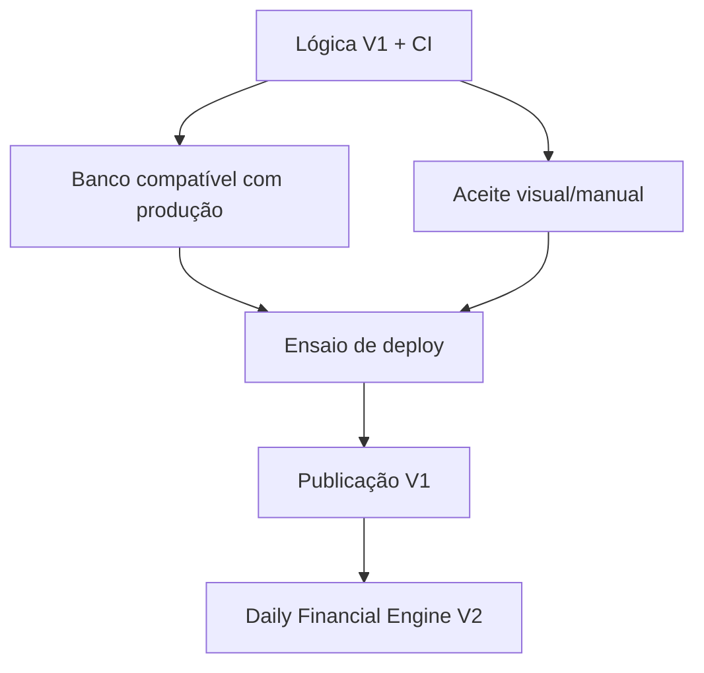

# Planejamento financeiro — etapas de execução

## Objetivo e fonte de verdade

Este roteiro acompanha a execução do [contrato funcional](FINANCIAL_PLANNING_CONTRACT.md), do complemento [CARD_REVERSAL_CONTRACT.md](CARD_REVERSAL_CONTRACT.md) e do estado atual da branch `codex/v1-card-reversal`.

As decisões P1–P6 foram aprovadas em 2026-09-08. O estorno/crédito de cartão foi fechado e implementado em 2026-09-13. WhatsApp, OFX e o Daily Financial Engine V2 permanecem fora desta publicação e não bloqueiam o V1.

Estados usados:

- **Concluída logicamente:** comportamento contratado implementado e coberto pela suíte automatizada disponível.
- **Parcial:** lógica disponível, mas existe gate funcional automatizado ainda aberto.
- **Aceite externo pendente:** lógica automatizada fechada; falta evidência que depende de ambiente real, banco de produção ou teste visual/manual.
- **Fora da entrega:** escopo explicitamente adiado.

## Estado consolidado

| Etapa | Estado | Entregue | Falta para publicação |
| --- | --- | --- | --- |
| E0 — Contratos verificáveis | Concluída logicamente | P1–P6, fórmulas, invariantes e contrato complementar de estorno/crédito | Manter sincronizado |
| E1 — Configuração financeira | Aceite externo pendente | Configuração mensal, proteção, essenciais, categoria rápida, isolamento, auditoria | Edge desktop/mobile, teclado, foco e valores longos |
| E2 — Planejamento e liquidação | Aceite externo pendente | Previsões, recorrência, residual, parcial, excesso, cancelamento, vínculo/desvínculo/revínculo, idempotência | Concorrência no banco compatível com produção e teste visual |
| E3 — Cartões, parcelas, estorno e crédito | Concluída logicamente | Compras, pagamentos, encargos, antecipação, estorno, crédito e aplicação explícita | Teste visual e evidência concorrente no banco real quando aplicável |
| E4 — Calculadora matemática | Concluída logicamente | Proteção, projeções, essenciais, margem, verba diária, déficit e faixas | Manter matriz de fronteiras |
| E5 — Integração e indicadores | Concluída logicamente | Visões atual/projetada, transferências neutras, cartões, estorno/crédito sem renda fictícia e recálculo | Jornada manual integrada e isolamento transversal em ambiente real |
| E6 — Histórico e alertas | Concluída logicamente | Fechamento, reconstrução, revisões, proveniência, alertas deduplicados, fallback para migration pendente | Aceite editorial/visual no Edge |
| E7 — WhatsApp | Fora da entrega | Independência preservada | Contrato futuro |
| V2 — Daily Financial Engine | Fora da entrega | Proposta em `DAILY_FINANCIAL_ENGINE_PROPOSAL.md` | Revisão/implementação após estabilização do V1 |

## Dependências de fechamento

A lógica do contrato V1 não possui, nesta branch, item funcional conhecido aguardando implementação. Os itens restantes são gates de evidência externa e publicação.

## E0 — Contratos verificáveis

### Entregue

- Competência versus pagamento, valores decimais exatos e calendário de Brasília.
- Invariantes de vínculo, residual, idempotência, exclusão, restauração e correção.
- Regras de proteção, essenciais, projeção, cartões, histórico e alertas.
- Crédito de cartão explicitamente separado de renda e caixa.
- Estorno em competência original com evento registrado na data real.
- Antecipação com desconto: estorno devolve somente o líquido efetivamente pago, nunca recria o desconto como crédito.
- WhatsApp, OFX e V2 explicitamente fora do V1.

## E1 — Configuração financeira

### Entregue

- Configuração por mês distinguindo ausência de dado de zero confirmado.
- Proteção fixa ou percentual e orçamentos essenciais.
- Cadastro contextual de categoria.
- Isolamento por usuário, auditoria, soft delete e controle de versão.

### Gate externo

- Microsoft Edge desktop/mobile real.
- Teclado, foco, zoom, valores longos e persistência visual.

## E2 — Previsões, compromissos e liquidação

### Entregue

- Previsões unitárias e recorrentes, inclusive regra do dia 31.
- Edição de ocorrência/futuras elegíveis e remarcação de residual.
- Recebimentos parciais, excesso informativo, atraso e cancelamento.
- Vínculo, desvínculo e revínculo explícito sem dupla renda.
- Locks de usuário nas mutações estruturais já endurecidas.
- Auditoria, isolamento, rollback e idempotência nos fluxos cobertos.

### Gate externo

- Concorrência no mesmo mecanismo de banco adotado na hospedagem; SQLite não comprova locks/deadlocks reais.
- Aceite visual de modais, recorrência e revínculo.

## E3 — Cartões, faturas, parcelas, estorno e crédito

### Entregue

- Cartões, compras parceladas e conservação de centavos.
- Pagamento total/parcial e dívida carregada sem duplicar consumo.
- Encargos confirmados como obrigações próprias e seleção explícita.
- Antecipação de parcelas futuras com desconto proporcional, prévia, proteção contra prévia obsoleta, idempotência e auditoria.
- Estorno de compra não paga: remove obrigação ativa sem criar crédito.
- Estorno parcial: cancela o residual e gera crédito somente do valor liquidado elegível.
- Estorno total: gera crédito sem apagar pagamentos históricos.
- Parcela antecipada com desconto: crédito usa `net_amount`, nunca o bruto nominal.
- Persistência própria para `card_purchase_reversals`, `card_credits` e `card_credit_allocations`.
- Parcelas estornadas recebem estado `reversed`; compra sai do conjunto ativo por soft delete, preservando persistência/auditoria.
- Aplicação de crédito é explícita, parcial, restrita ao mesmo usuário/cartão e não cria lançamento bancário.
- Estorno e aplicação usam lock por usuário, locks de recursos, idempotência, auditoria e transação atômica.
- HTTP e tela `Correções de cartão` entregues e adicionados à navegação.
- Testes cobrem não pago, parcial, integral, antecipação com desconto, replay e isolamento entre usuários.

### Critérios preservados

- Dívida 500 paga em 300 deixa 200.
- Encargo 15 transforma obrigação restante em 215 sem duplicar principal.
- Antecipar 200 por 190 compromete 190 agora e libera 200 futuros.
- Compra 300 não paga estornada: pendência zero, crédito zero.
- Compra 300 paga em 100: cancela 200 e gera crédito 100.
- Crédito 300 aplicado em 180 deixa saldo 120 e não gera entrada de caixa.
- Parcela nominal 100 antecipada por 95 gera, em estorno elegível, crédito 95.

## E4 — Calculadora matemática pura

### Entregue

- Cálculos sem consulta ao banco ou efeito colateral.
- `Brick Math`/decimais exatos, sem `float` nas regras financeiras.
- Proteção, progresso de recebimento, projeção, essenciais, margem, verba diária, déficit e situação.
- Fronteiras 90/100%, calendário Brasília e divisão segura.

### Gate permanente

Pagamento, previsão realizada, reembolso, estorno e crédito devem permanecer em conjuntos mutuamente exclusivos. Crédito de cartão nunca integra receita.

## E5 — Seleção de dados e indicadores

### Entregue

- Seleção por usuário/mês para ledger, previsões, reembolsos, parcelas, encargos e antecipações.
- Visões atual/projetada com renda, proteção, fixos, variáveis, essenciais, compromissos anteriores, margem e verba diária.
- Transferências internas neutras.
- Compra estornada sai das obrigações ativas sem criar receita fictícia.
- Aplicação de crédito reduz obrigação selecionada sem criar novo movimento de caixa.
- Alterações relevantes recalculam overview/alertas.

### Gate externo

- Jornada manual integrada no ambiente de uso.
- Confirmação transversal de isolamento em ambiente real.
- Estados incompleto, zero, déficit e valores longos no Edge desktop/mobile.

## E6 — Histórico e alertas internos

### Entregue

- Fechamento diário oficial e reconstrução com proveniência.
- Revisões encadeadas com `revision` e `supersedes_id` sem apagar o fechamento apresentado anteriormente.
- Correções retroativas de estorno/crédito reutilizam o mecanismo de revisão existente.
- Alertas por usuário/dia/visão, deduplicados, preservando pior situação e déficit observado.
- Reativação correta após recaída.
- Tela de avisos não retorna 500 quando `internal_alerts` ainda não existe: apresenta aviso de migration pendente e paginação vazia.
- `UpdateInternalAlert` vira no-op seguro quando o schema de alertas não existe, impedindo que migration pendente derrube a escrita financeira principal.
- A migration continua obrigatória antes de considerar o módulo de alertas operacional.

### Gate externo

- Linguagem, filtros, teclado e responsividade no Edge desktop/mobile.

## Evidência automatizada

Run de referência desta implementação: GitHub Actions `34784669863`, commit `e574462afebc9b80cb147eb615a275c49ef8eda7`.

- Pint: aprovado em 277 arquivos.
- PHPUnit: **388 testes / 2.124 asserções aprovados**.
- `npm ci`: aprovado, zero vulnerabilidades reportadas naquele run.
- Vite production build: aprovado.
- Manifest: todos os assets referenciados existentes.
- Artefato `public/build`: gerado e enviado pelo workflow.

Há commits posteriores de hardening/testes/UI; a evidência final de publicação deve apontar para o último HEAD verde, não para este run intermediário.

## E7 — WhatsApp opcional

Fora desta publicação. Deve ter contrato próprio de autorização, preferências, idempotência, fila, tentativas e falha isolada do núcleo financeiro.

## V2 — Daily Financial Engine

Fora do V1. `DAILY_FINANCIAL_ENGINE_PROPOSAL.md` registra custo diário estrutural, média real, orçamento diário, capacidade, folga acumulada, metas e demais métricas. Não alterar o V1 com regras V2 antes da revisão formal.

## Gates restantes antes de declarar o V1 publicado

1. Último HEAD da branch com Pint, suíte completa, build e manifest verdes.
2. Concorrência no banco compatível com produção.
3. Aceite visual/manual no Microsoft Edge desktop/mobile, incluindo teclado/foco.
4. Migrations ensaiadas no banco de destino com backup/rollback e preservação da `APP_KEY`.
5. OAuth, HTTPS, filas, scheduler, secrets e ausência de seeder de desenvolvimento validados.
6. Smoke test após implantação.
7. Só então integrar/mesclar conforme a estratégia de branches aprovada.

## Registro obrigatório por incremento

Manter este roteiro e `CODEX_HANDOFF.md` sincronizados com comportamento entregue, testes, riscos residuais e distinção entre evidência SQLite/CI e evidência do banco de produção.
