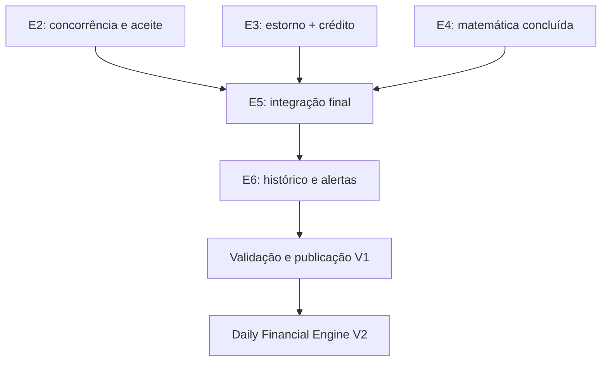

# Planejamento financeiro — etapas de execução

## Objetivo e fonte de verdade

Este roteiro acompanha a execução do [contrato funcional](FINANCIAL_PLANNING_CONTRACT.md). Ele descreve o estado atual da branch `codex/copilot-mod-v1-hardening`, não o estado histórico de incrementos intermediários.

As decisões P1–P6 foram aprovadas em 2026-09-08. A política complementar de estorno de compra foi fechada em `CARD_REVERSAL_CONTRACT.md` em 2026-09-13 para destravar E3. WhatsApp, OFX e o Daily Financial Engine V2 permanecem fora desta publicação e não bloqueiam o fechamento do V1. O detalhamento técnico e as pendências operacionais ficam em [CODEX_HANDOFF.md](CODEX_HANDOFF.md).

Estados usados:

- **Concluída:** implementação e testes automatizados cobrem o escopo contratado da etapa.
- **Parcial:** há implementação utilizável, mas ainda falta parte do contrato ou da aceitação.
- **Pendente:** não há entrega suficiente para declarar a etapa utilizável.
- **Fora da entrega:** escopo explicitamente adiado.

## Estado consolidado

| Etapa | Estado | Entregue | Falta para fechar |
| --- | --- | --- | --- |
| E0 — Contratos verificáveis | Concluída | Regras P1–P6, fórmulas, exemplos, invariantes e contrato complementar de estorno registrados | Manter documentação sincronizada quando o comportamento mudar |
| E1 — Configuração financeira | Parcial | Configuração mensal, proteção fixa/percentual, essenciais, categoria rápida, isolamento, auditoria e controle de versão | Aceite visual no Edge desktop/mobile |
| E2 — Planejamento e liquidação | Parcial | Previsões, recorrência, edição/remarcação, parcial, residual, excedente, cancelamento, vínculo, desvínculo e revínculo explícito | Concorrência no banco de produção e aceite visual |
| E3 — Cartões e parcelas | Parcial | Cartões, compras parceladas, pagamentos parciais, dívida carregada, encargos confirmados, antecipação com desconto e regra de negócio do estorno fechada | Implementar estorno de compra, crédito de cartão e aplicação explícita; HTTP/UI/testes |
| E4 — Calculadora matemática | Concluída | Proteção, progresso de recebimentos, projeções, essenciais, margem, verba diária, déficit e faixas | Manter matriz de fronteiras ao evoluir regras |
| E5 — Integração e indicadores | Parcial | Adaptadores reais, visões atual/projetada, neutralização de transferências/estornos, encargos e dashboard de planejamento | Integrar estorno/crédito após E3, jornada integrada final, isolamento transversal e aceite visual |
| E6 — Histórico e alertas | Parcial | Fechamento diário, reconstrução, revisões, proveniência, alertas deduplicados e gatilhos imediatos | Integrar novos fatos de E3 e fazer aceite editorial/visual da página de alertas |
| E7 — WhatsApp | Fora da entrega | Contrato de independência preservado | Implementação futura em contrato próprio |
| V2 — Daily Financial Engine | Fora da entrega | Proposta registrada em `DAILY_FINANCIAL_ENGINE_PROPOSAL.md` | Revisão formal somente depois do V1 estabilizado |

## Dependências de fechamento

E1 pode ser usada independentemente. E2 e E3 alimentam os indicadores de E5. E6 consome os resultados de E5, mas uma falha de histórico ou alerta não deve impedir o registro financeiro principal.

## E0 — Contratos verificáveis

### Entregue

- Competência versus pagamento, valores decimais exatos e calendário de Brasília.
- Invariantes de vínculo, residual, idempotência, exclusão, restauração e correção.
- Regras de proteção, essenciais, projeção, cartões, histórico e alertas.
- Exclusão explícita de WhatsApp e OFX da publicação atual.
- Contrato complementar de estorno de compra: competência corrigida permanece vinculada à compra original; data real do estorno/crédito é preservada; crédito de cartão não é renda nem caixa; aplicação é explícita.
- Proposta do Daily Financial Engine V2 registrada sem alterar o contrato vigente do V1.

### Gate permanente

Nenhuma mudança de código pode alterar silenciosamente uma decisão contratada. Ambiguidade de produto volta ao contrato antes da implementação dependente. Regras V2 não entram no V1 por conveniência de implementação.

## E1 — Configuração financeira

### Entregue

- Configuração por mês, distinguindo ausência de dado de zero confirmado.
- Proteção fixa ou percentual e orçamentos essenciais por categoria.
- Cadastro rápido de categoria de despesa sem perder o formulário.
- Isolamento por usuário, transação, auditoria, soft delete e controle de versão.

### Pendente

- Validar no Microsoft Edge desktop e em viewport móvel real.
- Confirmar teclado, foco, zoom, valores longos e persistência visual do formulário.

## E2 — Previsões, compromissos e liquidação

### Entregue

- Cadastro unitário e série recorrente mensal, inclusive retorno ao dia 31 após fevereiro.
- Edição da ocorrência ou das futuras ocorrências elegíveis da série.
- Remarcação do residual sem mover recebimentos já realizados.
- Vários recebimentos parciais por previsão e uma única previsão ativa por receita real.
- Pendência, cumprimento e excedente informativo sem duplicar renda.
- Cancelamento preservando valores já recebidos.
- Desvínculo por estorno/exclusão e revínculo somente por confirmação explícita.
- Idempotência, versão otimista, auditoria, isolamento e rollback nos fluxos cobertos.
- Atualização imediata dos alertas após criação, alteração, cancelamento e vínculo efetivos.
- Transferências usam o mesmo lock de usuário das mutações estruturais antes de ler saldo ou gravar pernas.
- Restauração de conta serializa pelo usuário e bloqueia relações restauradas em ordem determinística.
- Restauração de caixinha segue o mesmo lock de usuário, bloqueia conta, caixinha e lançamentos em ordem estável e aceita replay sem repetir auditoria.

### Pendente

- Executar evidência real de concorrência no mesmo mecanismo de banco escolhido para produção; SQLite continua insuficiente para comprovar locks/deadlocks.
- Executar aceite visual dos modais, recorrência e revínculo.

### Critérios obrigatórios preservados

- Previsto 1.000 e recebido 600 deixa residual 400.
- Cancelar o residual preserva os 600 realizados.
- Reenvio não duplica ocorrência nem vínculo.
- Vencido não muda de mês automaticamente.
- Restauração do lançamento não reativa vínculo silenciosamente.

## E3 — Cartões, faturas, parcelas, estorno e crédito

### Entregue

- Cadastro de cartão e compra total parcelada.
- Distribuição exata dos centavos entre parcelas.
- Pagamento total ou parcial limitado à dívida elegível.
- Alocação determinística por vencimento e identificador.
- Dívida anterior carregada e pagamento sem criar uma segunda despesa de consumo.
- Juros e multas confirmados são obrigações próprias, sem reapresentar o principal já carregado.
- Encargos só participam do pagamento quando selecionados explicitamente; seleção duplicada, recurso de outro usuário e encargo de outro cartão do mesmo usuário são recusados sem escrita financeira parcial.
- Antecipação seleciona parcelas de meses futuros, rateia o desconto proporcionalmente com centavos determinísticos, debita somente o líquido no presente e libera o bruto futuro sem alterar a compra nem os vencimentos originais.
- O fluxo de antecipação possui prévia por parcela, proteção contra prévia obsoleta, contrato HTTP, isolamento, idempotência, auditoria e atualização imediata dos alertas.
- O histórico da antecipação sobrevive ao expurgo da conta de origem; uma parcela possui no máximo uma alocação de antecipação e datas retroativas incompatíveis com pagamentos posteriores são recusadas.
- Regra funcional de estorno e crédito fechada em `CARD_REVERSAL_CONTRACT.md`.

### Pendente — próximo incremento obrigatório

1. Implementar estorno de compra não paga removendo apenas obrigações pendentes elegíveis.
2. Para compra parcial ou totalmente paga, gerar crédito somente pela parte paga elegível e cancelar somente o residual pendente.
3. Preservar compra, pagamentos e fechamentos históricos; correções posteriores usam revisão/proveniência.
4. Persistir data real do estorno separada da competência corrigida.
5. Implementar saldo de crédito de cartão sem classificá-lo como renda ou caixa.
6. Aplicar crédito a outra obrigação somente por associação explícita, inclusive aplicação parcial com residual.
7. Garantir idempotência, locks, auditoria, isolamento, rollback e ausência de consumo duplicado.
8. Acrescentar contratos HTTP, UI e testes independentes para estorno e crédito.

### Critérios obrigatórios preservados

- Dívida 500 paga em 300 deixa 200.
- Encargo 15 transforma a obrigação restante em 215, sem duplicar os 200.
- Antecipar obrigação 200 por 190 deve afetar 190 agora e liberar 200 futuros.
- Nenhuma parcela pode ser liquidada duas vezes.
- Compra 300 não paga estornada: pendência zero, crédito zero.
- Compra 300 paga em 100 e estornada: pendência cancelada 200, crédito 100.
- Compra 300 totalmente paga e estornada: pendência zero, crédito 300.
- Crédito 300 aplicado em obrigação 180 deixa crédito 120.
- Estorno em mês posterior corrige a competência de origem, registra o evento na data real e não cria receita sustentável.

## E4 — Calculadora matemática pura

### Entregue

- Cálculos sem consulta ao banco ou efeitos colaterais.
- Strings decimais exatas com Brick Math, sem `float`.
- Proteção fixa/percentual, progresso de recebimentos, projeção ordinária, essenciais, margem livre, verba diária, déficit e situação financeira.
- Relógio explícito, dias completos de Brasília, fronteiras 90/100%, centavos e divisão segura.

### Gate permanente

Os adaptadores devem entregar conjuntos exclusivos. Pagamento de obrigação, reembolso, previsão realizada, estorno e crédito não podem aparecer duas vezes em uma mesma visão. Crédito de cartão não integra receita.

## E5 — Seleção de dados e indicadores

### Entregue

- Seleção por usuário e mês para lançamentos, previsões, reembolsos, parcelas e encargos.
- Visões atual e projetada com renda, proteção, fixos, variáveis, essenciais, compromissos anteriores, margem e verba diária.
- Transferências internas neutras e estornos considerados semanticamente.
- Fronteiras mensais mantidas no fuso da aplicação.

### Pendente

- Integrar estorno de compra e crédito após o fechamento de E3 sem dupla contagem.
- Reexecutar o cenário contratual completo pelos endpoints e ações reais.
- Confirmar ausência de vazamento entre usuários em todos os consumidores.
- Validar estados incompleto, zero, déficit, valores longos e distinção atual/projetado no Edge desktop/mobile.

## E6 — Histórico e alertas internos

### Entregue

- Fechamento diário oficial e reconstrução de lacunas sem fingir apresentação ao usuário.
- Revisões encadeadas preservando resultados anteriores e origem da avaliação.
- Alertas internos por visão e mês, deduplicados e atualizáveis.
- Preservação da pior situação e do histórico de déficit.
- Reativação correta quando uma situação recuperada volta a piorar.
- Atualização imediata após lançamento manual, previsão, vínculo de recebimento, reembolso, estorno manual, compra, encargo e pagamento de cartão.
- Exclusão e restauração de lançamento, conta ou caixinha recalculam alertas somente quando o lote contém fatos relevantes ao planejamento.
- Política P5 desta publicação: avaliações/histórico e auditoria não são apagados automaticamente; eventual retenção destrutiva exige política própria antes de SaaS/exclusão de conta.
- CI com PHPUnit, Pint, build Vite e validação do manifest.

### Pendente

- Integrar os fatos de estorno/crédito de E3 ao fechamento/revisão e alertas.
- Validar linguagem, leitura, filtros, teclado e responsividade da página de alertas no Edge desktop/mobile.

### Evidência de referência

- CI de referência anterior às novas regras documentais: 378 testes PHPUnit e 2.049 asserções aprovados no run #47; Pint, build Vite e manifest aprovados.
- A criação de `CARD_REVERSAL_CONTRACT.md` ainda não representa implementação nem nova evidência de CI.

## E7 — WhatsApp opcional

Fora desta publicação. Quando retomado, deve possuir autorização, preferências, idempotência, tentativas limitadas e falha isolada do núcleo financeiro. Desligado deve enviar zero mensagens.

## V2 — Daily Financial Engine

Fora do V1. A proposta está em `DAILY_FINANCIAL_ENGINE_PROPOSAL.md` e inclui múltiplas métricas diárias, folga diária/acumulada, capacidade, orçamento, custo estrutural, metas e evolução do indicador de eficiência. Não iniciar implementação enquanto os gates do V1 não estiverem fechados, salvo trabalho estritamente documental/analítico sem alterar comportamento vigente.

## Gates para declarar o V1 fechado

- E2, E3, E5 e E6 sem itens funcionais pendentes dentro do escopo aprovado.
- Suíte completa, Pint e build aprovados no commit candidato.
- Testes de concorrência executados no banco compatível com produção.
- Aceite visual no Microsoft Edge desktop/mobile e verificação básica por teclado.
- Migrations ensaiadas com backup, rollback e preservação da `APP_KEY`.
- OAuth, HTTPS, filas, scheduler, secrets e ausência de seeder de desenvolvimento validados.
- Smoke test após a implantação.
- Documentação/handoff sincronizados com a evidência real do commit candidato.

## Registro obrigatório por incremento

Ao concluir trabalho, atualizar este roteiro e o `CODEX_HANDOFF.md` com:

- comportamento efetivamente entregue;
- arquivos alterados;
- testes executados e resultados;
- riscos residuais e dependências liberadas;
- distinção entre evidência SQLite e evidência do banco de produção.

Não marcar uma etapa como concluída apenas porque existem arquivos ou testes genéricos. Cada critério precisa de evidência que detectaria uma regressão concreta.
